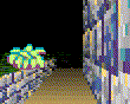
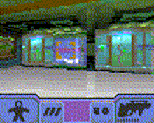
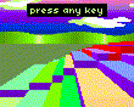
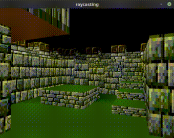
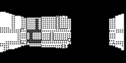
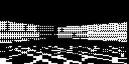
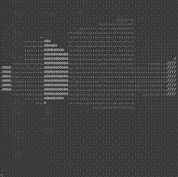
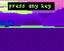

> [!WARNING]
> Just a quick note:
>
> I do not claim ownership of this repository. It belongs to someone else, and I won't provide a link to their personal webpage or mention their name directly in the `README.md` for reasons I will explain. Feel free to browse the commit history, or Google at your own risk.
>
> The original repo is hosted on a Git platform known for hosting many NSFW and controversial materials. I'm only mirroring it here on GitHub because I find the concept of a minimal (or as the author terms it, "suckless") "Doom"-style raycasting engine pretty cool.
>
> Briefly put, this engine is coded in C99, and all the essential work is done inside a single header file: `raycastlib.h`. This is where all the key processes take place. It aims to be lightweight, high-performance, advanced, and versatile.
>
> The engine doesn't handle rendering commands itself nor expects a specific graphics backend. You need to forward its rendering data to libraries such as OpenGL, SDL2, raylib, or others of your choice.
>
> 

>
> 
FOR YOUR SANITY, READ AT YOUR OWN RISK.

>
> If you want to know who developed this, I'm not naming him directly. But here's a little about him to give you an idea.
>
> He lives in the Moravian region of the Czech Republic, earned a master's in computer science from Brno University of Technology's Faculty of Information Technology, and identifies as an extreme anarchist who opposes capitalism and censorship, advocating for absolute free speech. He also relies on a Czech disability pension. He's said to be "EXTREMELY EXTRMELY \[sic\] ANTISOCIAL even by default, much more than you have ever seen".
>
> So, clearly, this is an eccentric but highly skilled Czech programmer. The one-header technique and the repo's performance claims prove it.
>
> Were you expecting some kind of Czech Terry A. Davis—a tragic figure with mental health struggles who amazed us with TempleOS? Well, that's just the tip of the iceberg...
>
> This man turns out to be much worse than you thought—he actively promotes harmful behaviour involving minors.
>
> And I'm not just picking through his content looking for dirt; the evidence is everywhere.
>
> On his main page, barely half a second of scrolling revealed this:
>
> > Since I've been banned from Wikipedia, here are some non-sexual, completely legal PHOTOS OF N\*\*\*D CHILDREN, hosted by Wikipedia itself.
>
> These images are hosted on Wikimedia Commons, which Wikipedia uses. Three aren't even on Wikipedia itself but on French Wikibooks. If you edit Wikipedia, you know such images only appear with strong justification, such as educational use, and even that is rarely granted.
>
> But here's the kicker: he's not just banned from Wikipedia. He's permanently blocked from all Wikimedia sites. The moderator spelt it out clearly:
>
> > You have been blocked indefinitely from editing for violations of the child protection policy, based on your comment on your personal website (which is openly linked from your userpage) that violating "arbitrary law-imposed age limits" regarding sex is not problematic and your advocacy for legalizing child p\*\*\*\*graphy on the same page, as well as a history of \*\*\*\*phile-coded conduct on-wiki [...]
>
> Under "Some things I like", he actually puts down "child n\*\*\*ty" and the N-word. I'm being sincere here. As sincere as how Wikipedia defines it (read the article yourself). Good Lord!
>
> According to Hacker News users:
>
> > OTOH this guy claims to have "non-sexual" pictures of n\*\*\*d children on his website. Damned if I'm going to click through to see if his idea of non-sexual is the same as mine. Someone advocating \*\*\*\*philia while collecting pictures of n\*\*\*d children is beyond the pale. That's acting on it. I cannot and will not tolerate, let alone accept, that action.
>
> > This is from his homepage. This dude is weird af. Certainly gives off some p\*\*\* incel vibes.
>
> > Damn, what a combo... if HN had default link colors, I'd say that one stays blue
>
> > 2 minutes later, I noped out of there. I want nothing to do with this person.
>
> > In short - this guy is as if someone took the worst opinions from a left-wing person and the worst opinions from a right-wing person. I hope he can get treated for whatever condition he has and live normally. I feel sorry for him.
>
> *I would've felt sorry too if this guy didn't spout out "hurr-durr \*\*\*\*philia is not bad!" every five seconds.*
>
> He has a "wiki" (despite being the only one who can edit it) called "Less R\*\*\*\*\*ed Wiki" (yes, that R-word, and he's a big proponent of "free speech"—including hate speech, apparently). On that wiki, he openly supports \*\*\*\*philia and the legalisation of CSAM—that vile, illegal exploitation involving children.
>
> Good grief, mother of all saints. I can hardly believe this is real... He's giving Amos Yee a run for his Singaporean dollars. This is utterly unacceptable. I don't live in the Czech Republic, but if you do and have children nearby, I urge you to stay as far away as possible. Protect your kids and yourself. Run and don't come back. I don't need to say more, but I wouldn't be surprised if Europol showed up at his door soon—for all the right reasons.
>
> 

>
> You might wonder why I bother mirroring something created by such a reprehensible individual. It comes down to the saying, "I disapprove of the artist, but I like the art". It reflects the idea that a person's talent doesn't always reflect their morality. To this day, people still discuss the art of "That Austrian Artist Named Adolf". While his drawings often feel dry and impersonal—largely due to his focus on buildings over people—they were apparently crafted with great precision, especially in terms of architectural detail.
>
> In the end, enjoy the code, but don't endorse the creator. Let me be clear—this is some top-tier C programming. He's got serious chops. But when you factor in his dangerous views, any sense of admiration is completely erased.
>
> P.S.: He said he got banned from 4chan. Typically, that happens for one of two reasons: you're a bot/spammer, or you're someone even 4chan can't stomach. And in this case, it's definitely not the former. Face it—4chan isn't exactly full of choirboys. But if even those anons find you repulsive, something's seriously off about you.

---

# raycastlib

Public domain ray casting library for (not only) resource-limited computers.

## eye-candy previews

Pokitto (32bit embedded console, 48 MHz, 36 kB RAM):

SDL (PC):

Arduboy (8bit Arduino console, 16 MHz, 2.5 kB RAM):

terminal:

Gamebuino META (Arduino 32bit console, 48 MHz, 32 kB RAM):

## features

- Very **fast, small and efficient**.
- Uses **only integer math** (32bit). The tiny version should only require 16bit, but isn't completed.
- **No dependencies** (uses only stdint standard library), extremely portable.
- **Single header**, KISS, suckless.
- **No dynamic heap allocation**.
- Advanced rendering of **variable height floor and ceiling**.
- **Textured walls and floor**.
- **Depth information** (e.g. for fog or z-buffer rendering).
- **Camera shearing** (looking up/down).
- Camera movement with **collisions**.
- Partial support for **opening door**.
- **Pure C99**, tested to run as C++ as well.
- Optional framework **functions that handle the whole rendering**.
- Still **flexible** -- pixels are left for you to draw in any way you want.
- **Tested on many platforms**:
  - PC (little endian, 64bit GNU)
  - PowerPC emulator (big endian)
  - compilers: gcc, clang, emscripten (web browser, JavaScript transpile)
  - Arduboy (only experimental)
  - Pokitto (32bit resource-limited embedded ARM)
  - Gamebuino META (32bit resource-limited embedded ARM)
  - TODO:
    - Android
    - Windows
- **Many compile-time options** to tune the performance vs quality.
- **Well commented** and formatted code, with examples. Automatic documentation (comments + provided Doxyfile).
- Completely **free of legal restrictions**, do literally anything you want.

**NOTE**: Backwards compatibility isn't a goal of this libraray. It is meant to be an as-is set of tools that the users is welcome to adjust for their specific project. So new features will be preferred to keeping the same interface.

## how to use

**Don't forget to compile with -O3!** This drastically improves performance.

For start take a look at the [helloWorld.c](programs/helloWorld.c) program and other examples.

Also see **the library code itself**, it is meant to be self-documenting -- you'll find the description of a lot of things at the start of the file.

The basic philosophy is:

- The library implements only a **rendering back-end**, it doesn't perform any drawing to the actual screen, hence there is no dependency on any library such as OpenGL or SDL. It just calls your front-end function and tells you which pixels you should write. How you do it is up to you.
- Before including the header, define `RCL_PIXEL_FUNCTION` to the name of a function you will use to draw pixels. It is basically a fragment/pixel shader function that the library will call. You will be passed info about the pixel and can decide what to do with it, so you can process it, discard it, or simply write it to the screen.
- Call `RCL_renderSimple` or `RCL_renderComplex` to perform the frame rendering. This will cause the library to start calling the `RCL_PIXEL_FUNCTION` in order to draw the frame. You can optionally write  a similar function of your own using the more low-level functions which are also provided.
- The library gets info about the world (such as floor or ceiling height) via *array* functions  (`RCL_ArrayFunction` type) -- functions that take *x* and *y* coordinates of a square and return given information. This way you are free to not only fetch the map data from an array, but also generate  the world procedurally if that is what you want.
- Fixed point arithmetics is used as a principle, but there is no abstraction above it, everything is simply an integer (`RCL_Unit` type). The space is considered to be a dense grid, where each world square has a side length of `RCL_UNITS_PER_SQUARE` units. Numbers are normalized by this constant, so e.g. the sin function returns a value from `-RCL_UNITS_PER_SQUARE` to `RCL_UNITS_PER_SQUARE`.

## license

Everything is CC0 1.0 (public domain, https://creativecommons.org/publicdomain/zero/1.0/) + a waiver of all other IP rights (including patents).

I've written all code completely myself from scratch, the art used in demos is either my own released under CC0 or someone else's released under CC0.

This is not a mandatory condition, but please consider supporting free software and free culture by using free licenses and/or waivers.

You can also choose to use this under the following waiver which is here to just ensure more legal safety and waiving of additional IP such as patents:

The intent of this waiver is to ensure that this work will never be encumbered by any exclusive intellectual property rights and will always be in the public domain world-wide, i.e. not putting any restrictions on its use.

Each contributor to this work agrees that they waive any exclusive rights, including but not limited to copyright, patents, trademark, trade dress, industrial design, plant varieties and trade secrets, to any and all ideas, concepts, processes, discoveries, improvements and inventions conceived, discovered, made, designed, researched or developed by the contributor either solely or jointly with others, which relate to this work or result from this work. Should any waiver of such right be judged legally invalid or ineffective under applicable law, the contributor hereby grants to each affected person a royalty-free, non transferable, non sublicensable, non exclusive, irrevocable and unconditional license to this right.
